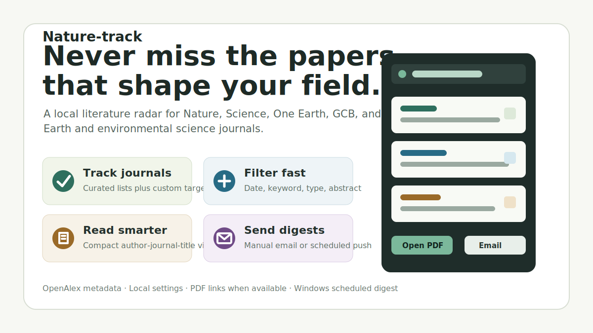

# Nature-track



Nature-track is a local literature radar for researchers who need to keep up with high-impact Earth and environmental science journals without repeatedly checking publisher websites. It turns recent publication metadata into a focused reading feed: select the journals you care about, narrow the feed by date, article type, and keywords, then open the papers that matter.

The project is designed for a simple daily or weekly workflow: scan new publications, identify relevant papers quickly, open available PDFs, and push a digest to your mailbox when you want the tracker to run in the background.

## What It Does

- Tracks selected journals from the Nature family, Science family, and major Earth/environment titles.
- Searches recent publication metadata through [OpenAlex](https://openalex.org/), an open scholarly metadata source.
- Filters papers by publication window, article type, abstract availability, and local keyword matches.
- Presents results in a compact researcher-friendly format:

`first author_corresponding author_journal_title`

- Expands each record with DOI, abstract, author list, open-access status, DOI link, and PDF link when available.
- Saves tracker preferences locally for repeat use.
- Sends manual or scheduled email digests from your own mailbox credentials.

## Quick Start

```powershell
python -m venv .venv
.\.venv\Scripts\Activate.ps1
pip install -r requirements.txt
streamlit run app.py
```

## Email Digest

1. Open the app and choose your sender email provider.
2. Fill in sender email, mailbox authorization code/app password, and recipient email.
3. Click `Save settings`.
4. Click `Send test digest` to verify delivery.
5. For scheduled delivery, create a Windows scheduled task that runs:

```powershell
.\.venv\Scripts\python.exe scripts\send_digest.py
```

Or register it from PowerShell:

```powershell
powershell -ExecutionPolicy Bypass -File scripts\register_windows_task.ps1 -Frequency weekly -WeeklyDay Monday -Time 08:00
```

The script reads `data/settings.json`, fetches the latest matching articles, and sends the same compact list to the configured recipient.

## Notes

- OpenAlex metadata can be incomplete. If a corresponding author is unavailable, Nature-track falls back to the last author and marks it as inferred in the expanded details.
- Publisher downloads are only available when OpenAlex exposes an open-access PDF URL.
- Nature-track does not include a shared built-in sender account. A local sender account needs your mailbox SMTP authorization code because public embedded credentials would be insecure and quickly blocked.
